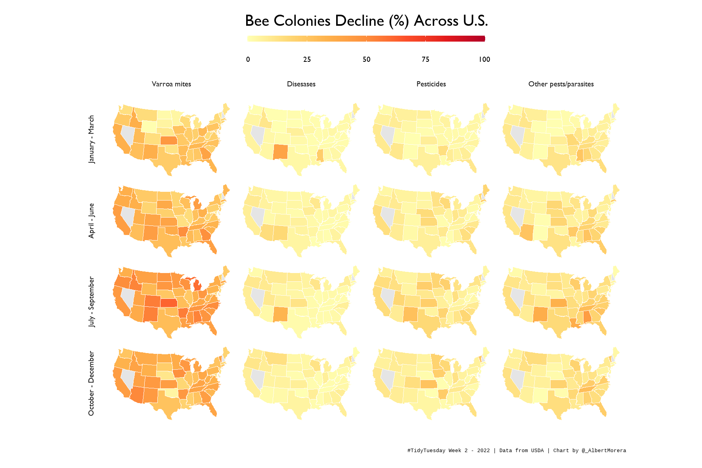

# #TidyTuesday

## Latest Visualizations

### **[Week 2 - 2022 | The Fellowship if the Ring Dialogs (2022W2)](2022/W2)**
I explore which characters from the Fellowship of the Ring have the most dialogs during the Lord of the Rings trilogy.

Data extracted from [USDA](https://usda.library.cornell.edu/concern/publications/rn301137d?locale=en).

### **[Week 1 - 2022 | The Fellowship if the Ring Dialogs (2022W1)](2022/W1)**
I explore which characters from the Fellowship of the Ring have the most dialogs during the Lord of the Rings trilogy.

Data extracted from [kaggle](https://www.kaggle.com/paultimothymooney/lord-of-the-rings-data/version/1?select=lotr_scripts.csv).

